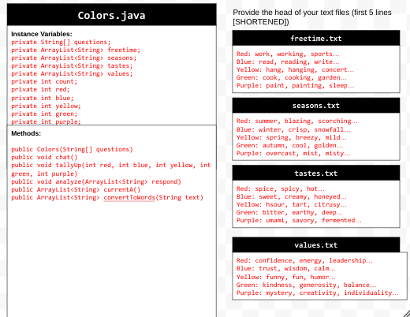
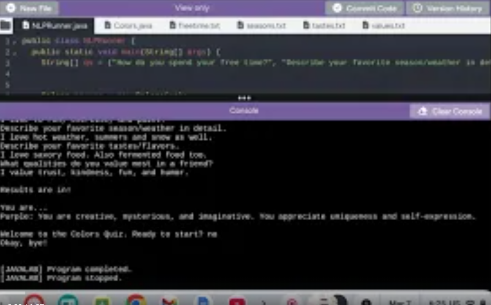

# Unit 6 - Natural Language Processing Project

## Introduction

Natural language processing (NLP) is used in many apps and devices to interact with users and make meaning of text to determine how to respond, find information, or to create new text. Your goal is to use natural language processing techniques to identify structure, patterns, and meaning in a text to have conversations with a user, execute commands, perform manipulations on the text, or generate new text.

## Requirements

Use your knowledge of object-oriented programming, ArrayLists, the String class, and algorithms to create a program that uses natural language processing techniques:

- **Create at least two ArrayLists** – Create at least two ArrayLists to store the data used in your program, such as data from text files or entered by the user.
- **Implement one or more algorithms** – Implement one or more algorithms that use loops and conditionals to find or manipulate elements in an ArrayList or String object.
- **Use methods in the String classs** - Use one or more methods in the String class in your program, such as to divide text into sentences or phrases.
- **Use at least one natural language processing technique** – Use a natural language processing technique to process, analyze, and/or generate text.
- **Document your code** – Use comments to explain the purpose of the methods and code segments and note any preconditions and postconditions.

## UML Diagram

Put and image of your UML Diagram here. Upload the image of your UML Diagram to your repository, then use the Markdown syntax to insert your image here. Make sure your image file name is one word, otherwise it might not properly get display on this README.

## Video

Record a short video of your project to display here on your README. You can do this by:

- Screen record your project running on Code.org.
- Upload that recording to YouTube.
- Take a thumbnail for your image.
- Upload the thumbnail image to your repo.
- Use the following markdown code:

## Project Description

The goal of my application was to provide the user insight on their personality represented as a color. The text being analyzed is the user input, which is sentences as answers. There are also 4 text files being analyzed in order to interpret the user input.

## NLP Techniques

Write a description of what natural lanugage technique (NLP) you implemented in your project. State which methods in your project are associated with this, and a brief explanation of how those methods word and how they are necessary in the NLP technique. 

I implemented text segmentation in this project. The method that this is implemented in is the convert to words method. This method changes a string into an array list of words. This is text segmentation because I separated strings by the word. I didn't use any provided NLP techniques from the project guide, the closest it could be would be the Named Entity Recognition (NER) because I identified keywords from the text files. This method helps me identify keywords because it separates them into words that can be compared to the words in the text files.